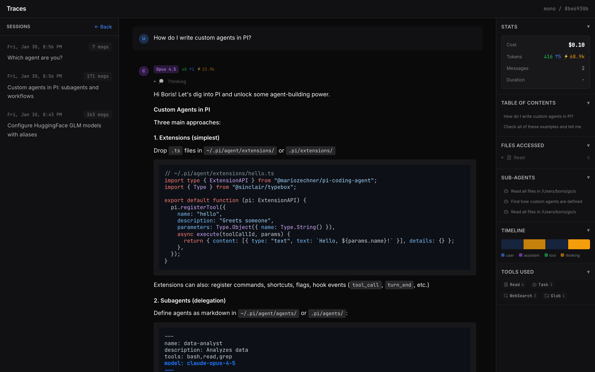

# Traces

A local viewer for Claude Code conversation history.



## Features

- **Browse Sessions** — Navigate projects and conversations from `~/.claude/`
- **Token Stats** — Input/output/cached tokens with cost estimates
- **Tool Inspector** — Expand tool calls to see inputs and results
- **File Tracking** — See which files were read, edited, or created
- **Timeline** — Visual density of token usage per turn
- **Deep Links** — URL hash routing for bookmarking sessions
- **Agents Tree** — View subagent conversations

## Quick Start

```bash
npx github:bokan/traces
```

Or clone and run:
```bash
git clone https://github.com/bokan/traces && cd traces
npm install && npm start
```

Open http://localhost:3847

## Stack

- Express server (reads `~/.claude/` directly)
- React + Tailwind (via CDN, no build step)
- Lucide icons
- Playwright tests

## URL Routing

Sessions are addressable via hash:
```
http://localhost:3847/#/project-id/session-id/agent-id
```

## License

MIT
